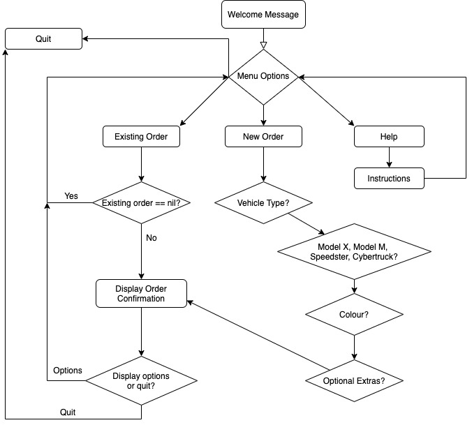

# Testla Motors

## Ruby Terminal App

by Tyler Hall

Link to the repository - [https://github.com/Impicklerick12/virtual_car_dealership](https://github.com/Impicklerick12/virtual_car_dealership "Tyler's Github Repository")

Files:

* [Development Log](https://github.com/Impicklerick12/virtual_car_dealership/blob/master/development_log.md "Development Log Link")

## About the App

### Description

The Testla Motors app is a representation of an virtual car dealership. It is a MVP that allows the user to shop through different Testla models, customise them, and confim their purchase. There are also optional additions that may be purchased and added to the orders.

The app was created in a time of uncertainty, where a large portion of the population are confined mostly to their homes with minimal access to physical shops and industries. Online interaction with customers is critical, and a solutions needs to be  developed which allow any potential customers to shop from home with clarity and confidence. The Testla Motors app provides a platform where interested car enthustiasts are able to browse the Testla models, view the different features, create and customize an order, and view any existing orders. All from the comfort of their living room!

### Functionality

Once the app has been opened on the users system, it will prompt the user for their name. This is to provide a personalised service to all potential customers. Once the user has entered their name, they will be directed to a menu screen which will provide them with several options. These options include:

* Placing a new order
* View an existing order
* Information on Testla Motors and vehicles
* Help/instructions screen
* Quit the app

When the user chooses to place a new order, they are presented with the different models of Testla vehicles, and prompted to choose one to continue with the purchase. Following their Testla model of choice, they are prompted to choose a colour, and then add any optional extras. Their order is then created.

If the user has placed an order, they are able to view it from the main menu via the ‘View an existing order’ option. Otherwise they will be notified that there is no order confirmation yet, and that they will need to return to the menu to place a new order. 

We want to provide the user with as much information as possible about Testla Vehicles and the company. The help and information page advises the user on how to navigate through the app, and provide the specifications on each model.

Once the user has finished using the app, they may quit at any time, where a personalised message will be displayed to them.

The Testla Motors app was designed to create a platform where user input and error is minimised. It was our mission to create a step-by-step process where the user is able to follow along easily simply using the enter and arrow keys. The use of the TTY-Prompt gem allowed us to simplify menu and option screens, minimizing user text input, and showing a visual representation of all options. 

### Installation Instructions

1. Firstly, you will need to ensure that ruby is installed on your computer. [Download ruby here](https://www.ruby-lang.org/en/).

2. Download the zip file or clone this repository to your local computer.

3. The Bundler Gem is also required to run the application. If you do not already have it installed, you can install it using the following command:

    `> gem install bundler`

4. Navigate to the location of the `/src` folder in  this repostitory on your computer. To install the gems used in this project, type the following command:

    `> bundle install`

5. Now the app is ready to run! To run the app, enter the following command to run the main file:

    `> ruby main.rb`

6. Alternatively, you may run the app with the insertion of your first name as a user. Eg.

    `> ruby main.rb varsha`

## Planning Process and Design Implementation

The planning process started with a brainstorming session to provide some possibile applications that would satisfy the requirements of the rubric, yet also provide a challenege for myself. Initially I was focused on a virtual garden application, which would require the user to maintain a garden and provide plants with care. Another alternative was a quiz application, where users would need to complete several topics in order to complete the game. 

Eventually I settled on the virtual car dealership application as it required multiple classes and inhertiance, and a variety of conditional control structures. The first step was to determine what the purpose of the application was, then move on to what the framework would look like, and finally how the user would navigate through the menus. 

### Flow Chart

### Implementation Plan (Trello)

I used Trello as a project manager application, which included adding 'cards' for all the features that needed implementation as well as optional features and documentation items. Cards were labelled according to their nature (coding or documentation) and also by their importance (P1, P2, P3). Additional items were added close to the submission date, for possible future implementation.

### Testing

Testing was done at every stage in the application construction process. Initially it was quite simple to manually test that features/classes/methods were producing the expected output. As the project went along and the code was refactored, I found it more difficult to determine *what* needed testing and what user errors were simply illiminated by the use of the TTY-Prompt gem. 

### Code Structure

    `> main.rb`

The main file that controls the application flow and user_name entry

    `> classes/vehicle.rb`

Holds the data for each vehicle model. Each model is initiated, inheriting the variables from the parent vehicle class.

    `> classes/dealership.rb`

The dealership class, which when initiated provides the contact information for the help menu.

    `> classes/order.rb`

The file that processes the order information and display.

    `> classes/stock.rb`

The stock class that includes the information on each model that has been initiated.

    `> classes/user.rb`

File that contains the user information. It is initiated from the main screen, provided a name attribute, and contains the number of orders.

    `> methods/helper_methods.rb`

A handy file that allows access to various methods that are called throughout the application.

    `> methods/banners.rb`

Contains methods that create the visual banners that are displayed.

### Gems

* TTY-Prompt: Enabled the creation of clean listed options and menus. This was especially handy in minimising user input error, as only listed options are able to be selected.

* Colorize: Allowed strings to be coloured, providing an extra visual element to the displays.

* Progress-Bar: Another visual element to display the creation of an order. Adds authenticity to the order confirmation process.

* Faker: Was used extensively to provide information that did not require hard coding. The dealership contact information is generated using Faker variables, and the user name will be generated at random if the user fails to provide a name at application startup.

### Future Planning and Implementation

### Acccessibility

