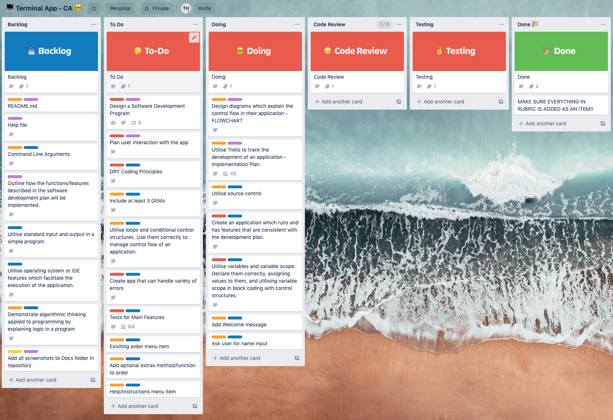
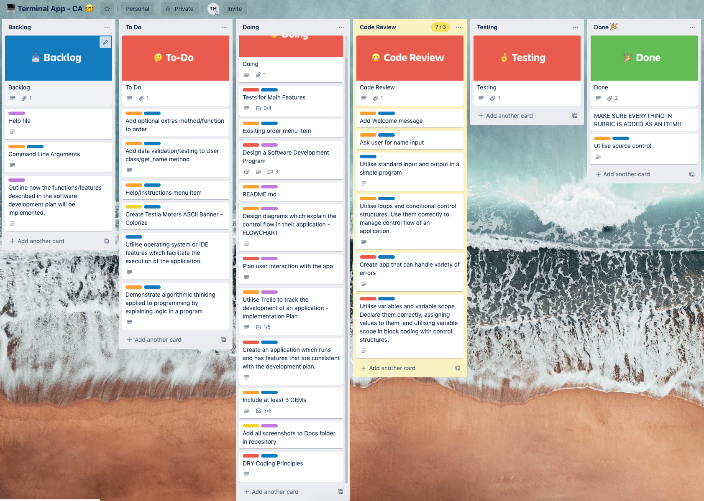

# Testla Motors

## Ruby Terminal App

by Tyler Hall

Link to the repository - [https://github.com/Impicklerick12/virtual_car_dealership](https://github.com/Impicklerick12/virtual_car_dealership "Tyler's Github Repository")

Files:

* [Development Log](https://github.com/Impicklerick12/virtual_car_dealership/blob/master/development_log.md "Development Log Link")

## About the App

### Description

The Testla Motors app is a representation of an virtual car dealership. It is a MVP that allows the user to shop through different Testla models, customise them, and confim their purchase. There are also optional additions that may be purchased and added to the orders.

The app was created in a time of uncertainty, where a large portion of the population are confined mostly to their homes with minimal access to physical shops and industries. Online interaction with customers is critical, and a solutions needs to be  developed which allow any potential customers to shop from home with clarity and confidence. The Testla Motors app provides a platform where interested car enthustiasts are able to browse the Testla models, view the different features, create and customize an order, and view any existing orders. All from the comfort of their living room!

### Functionality

Once the app has been opened on the users system, it will prompt the user for their name. This is to provide a personalised service to all potential customers. Once the user has entered their name, they will be directed to a menu screen which will provide them with several options. These options include:

* Placing a new order
* View an existing order
* Information on Testla Motors and vehicles
* Help/instructions screen
* Quit the app

When the user chooses to place a new order, they are presented with the different models of Testla vehicles, and prompted to choose one to continue with the purchase. Following their Testla model of choice, they are prompted to choose a colour, and then add any optional extras. Their order is then created.

If the user has placed an order, they are able to view it from the main menu via the ‘View an existing order’ option. Otherwise they will be notified that there is no order confirmation yet, and that they will need to return to the menu to place a new order. 

We want to provide the user with as much information as possible about Testla Vehicles and the company. The help and information page advises the user on how to navigate through the app, and provide the specifications on each model.

Once the user has finished using the app, they may quit at any time, where a personalised message will be displayed to them.

The Testla Motors app was designed to create a platform where user input and error is minimised. It was our mission to create a step-by-step process where the user is able to follow along easily simply using the enter and arrow keys. The use of the TTY-Prompt gem allowed us to simplify menu and option screens, minimizing user text input, and showing a visual representation of all options. 

### Installation Instructions

## Planning Process and Design Implementation

### Flow Chart

### Timeline

### Implementation Plan (Trello)

### Testing

### Code Structure

- 'main.rb'

- 'classes/'

### Gems

### Error Handling

### Future Planning and Implementation

### Acccessibility

