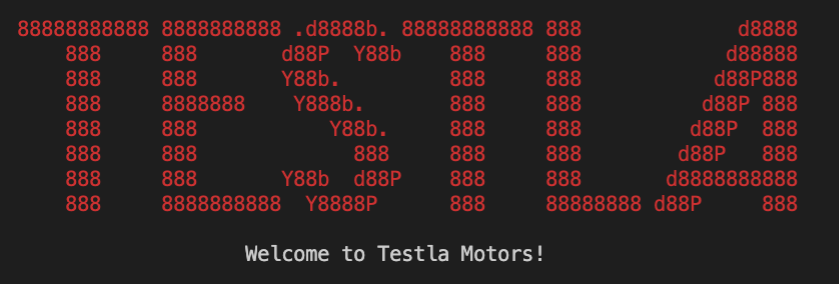

# Testla Motors

## Development Log

###### By Tyler Hall

> Monday 20th of April, 2020

- Assessment was presented to class, rubric outlined
- Inital flowchart created - 
- Creation of Trello board
- Add every item in rubric to Trello

> Tuesday 21st of April, 2020

- First commit
- Created main.rb file and classes directory
- Created main classes - Vehicle, Stock, Order
- Created methods for each class
- Tested first order in order.rb
- Updates to README.md with headings and project description

> Wednesday 22nd of April, 2020

- Updated Trello board
- Added screenshots to docs directory
- Cloned code into ED for Educator review and assistance
- Research and installation of Gems

> Thursday 23rd of April, 2020

- Update Trello board
- Update to README.md including screenshots
- Changes to order menu, helper methods and main.rb
- Utilized TTY-Prompt to create menu and option lists
- Updated bash script

-----
## Halfway? 

So far I have laid the foundation for the app, asking the user for their name, providing menu options, and completing the order process. At the moment it looks as though it is running error free thanks to the handy implementation of the TTY-Prompt gem menus. To be honest I am happy with the progress so far, yet I still feel like I have a way to go to get the project to my desired expectations. I am struggling with adding a colour variable to each vehicle after they select it, and also provide an optional extras menu which will add to the total if purchased. I will persist though. This has been daunting, overwhelming, and incredibly rewarding.

-----

> Friday 24th of April, 2020

- Development log updates and README.md alterations.
- Added colour selection to order.rb
- Use of colorize gem for headers
- Creation of command line argument

> Saturday 25th of April, 2020

-
-
-
-